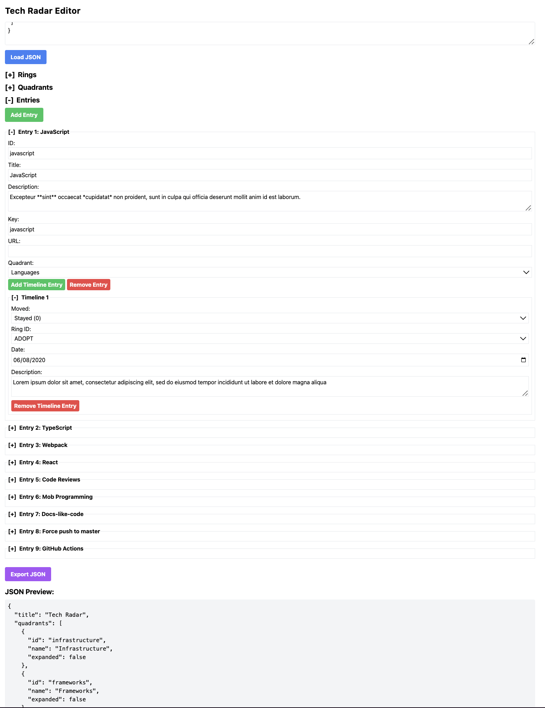

# Tech Radar Editor


A web component providing an easy-to-use UI that allows users to easily create and edit a Tech Radar without having to directly modify a JSON file. It also adds validation to ensure that your Tech Radar is always in a valid state.



## Who created the Tech Radar?

[ThoughtWorks](https://thoughtworks.com/radar) created the Tech Radar concept, and [Zalando created the visualization](https://opensource.zalando.com/tech-radar/) that is popular today.

### Purpose

Zalando has a fantastic description [on their website](https://opensource.zalando.com/tech-radar/):

> The Tech Radar is a tool to inspire and support engineering teams at Zalando to pick the best technologies for new projects; it provides a platform to share knowledge and experience in technologies, to reflect on technology decisions and continuously evolve our technology landscape. Based on the pioneering work of ThoughtWorks, our Tech Radar sets out the changes in technologies that are interesting in software development — changes that we think our engineering teams should pay attention to and consider using in their projects.

It serves and scales well for teams and companies of all sizes that want to have alignment across dozens of technologies and visualize it in a simple way.

## Packages

This is a monorepo containing three packages:

| Package | Description |
|---------|-------------|
| [`tech-radar-editor`](./packages/tech-radar-editor) | The core web component (`<tech-radar-editor>`) |
| [`tech-radar-editor-backend`](./packages/tech-radar-editor-backend) | Backstage backend plugin for Azure DevOps integration |
| [`tech-radar-editor-backstage`](./packages/tech-radar-editor-backstage) | Backstage frontend wrapper component |

## Include the Component in Spotify Backstage

### Quick Start

1. Install packages:

```bash
# From your Backstage root directory
yarn --cwd packages/app add tech-radar-editor-backstage
yarn --cwd packages/backend add tech-radar-editor-backend
```

2. Add config to `app-config.yaml`:

```yaml
techRadarEditor:
  organization: my-org
  project: my-project
  repository: my-repo
  filePath: /tech-radar.json     # optional, defaults to /tech-radar.json
  targetBranch: main             # optional, defaults to main
```

3. Register the backend plugin in `packages/backend/src/index.ts`:

```ts
backend.add(import('tech-radar-editor-backend'));
```

4. Add the route in your `packages/app/src/App.tsx`:

```tsx
import { TechRadarEditorPage } from 'tech-radar-editor-backstage';

// In your routes:
<Route path="/tech-radar-editor" element={<TechRadarEditorPage />} />
```

That's it! The editor will fetch data from your Azure DevOps repository and allow users to submit changes as pull requests.

## Use the Web Component Standalone

### In Plain HTML

```html
<!DOCTYPE html>
<html lang="en">
  <head>
    <meta charset="UTF-8" />
    <title>Tech Radar Editor</title>
    <script type="module" src="./tech-radar-editor.es.js"></script>
  </head>
  <body>
    <tech-radar-editor></tech-radar-editor>
  </body>
</html>
```

### In React

```tsx
import 'tech-radar-editor';

function App() {
  return <tech-radar-editor></tech-radar-editor>;
}
```

### With a Data URL

Load JSON from a URL on mount:

```html
<tech-radar-editor data-url="https://example.org/tech-radar.json"></tech-radar-editor>
```

### With Inline JSON Data

Pass JSON directly via attribute:

```html
<tech-radar-editor data-json='{"title":"My Radar","quadrants":[],"rings":[],"entries":[]}'></tech-radar-editor>
```

### Web Component Props

| Attribute | Type | Default | Description |
|-----------|------|---------|-------------|
| `data-url` | `string` | `''` | URL to fetch JSON data from on mount |
| `data-json` | `string` | `''` | JSON string to load directly (bypasses URL fetch) |
| `hide-title` | `boolean\|string` | `false` | Hide the h1 heading |
| `hide-export` | `boolean\|string` | `false` | Hide the "Export JSON" button |
| `hide-json-input` | `boolean\|string` | `false` | Hide the textarea + "Load JSON" button |
| `hide-json-preview` | `boolean\|string` | `false` | Hide the "JSON Preview" section |
| `auto-expand-entries` | `boolean\|string` | `false` | Auto-expand the Entries section on load |

### Custom Events

| Event | Detail | Description |
|-------|--------|-------------|
| `radar-data-loaded` | `{ data: TechRadarData }` | Fired once when data is first loaded |
| `radar-data-change` | `{ data: TechRadarData }` | Fired whenever the data changes |

```js
const editor = document.querySelector('tech-radar-editor');
editor.addEventListener('radar-data-change', (e) => {
  console.log('Updated data:', e.detail.data);
});
```

## Building

```bash
pnpm install
pnpm build
```

To develop the web component with hot reload:

```bash
pnpm dev
```

To publish the packages to npm:

```bash
pnpm build
cd packages/tech-radar-editor && npm publish
cd packages/tech-radar-editor-backend && npm publish
cd packages/tech-radar-editor-backstage && npm publish
```
